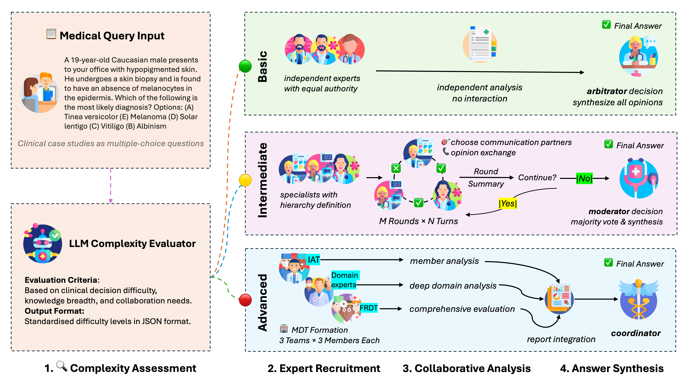

# MediAgents: Adaptive Multi-Agent AI System for Medical Decision-Making

[](https://www.python.org/downloads/)
[](https://opensource.org/licenses/MIT)
[](https://ai.google.dev/)
[](https://openai.com/)

An advanced multi-agent AI system that demonstrates sophisticated **agent collaboration patterns** and **adaptive intelligence routing** for medical question answering. Built on collaborative Large Language Models with dynamic difficulty assessment and intelligent agent orchestration.

## 🎯 Key Achievements

### 🚀 Breakthrough Performance Improvements
- **+15.73% accuracy improvement** over original NeurIPS 2024 paper (95.18% vs 79.45%)
- **89.3% token reduction** (7.23M vs 67.44M tokens) - massive efficiency gain
- **Perfect performance** on intermediate and advanced cases (100% accuracy)
- **Cost-effective variant** achieving 84.04% accuracy with budget models

### 💡 Technical Leadership & Innovation
- **Multi-Agent Architecture**: Designed hierarchical agent systems with adaptive collaboration
- **Intelligent Routing**: Implemented dynamic difficulty assessment for optimal resource allocation  
- **Production Engineering**: Built robust error handling and multi-pattern fallback mechanisms
- **Cross-Platform Integration**: Seamless compatibility across Gemini and OpenAI model families

## 🤖 Technical Innovation

### Advanced AI Agent Architecture
- **Adaptive Agent Selection**: Dynamic routing based on question complexity analysis
- **Hierarchical Collaboration**: Three-tier processing with specialized agent roles
- **JSON-Based Communication**: Structured inter-agent protocols with error resilience
- **Intelligent Arbitration**: Multi-expert consensus with conflict resolution mechanisms

### Production-Ready Engineering
- **Multi-Pattern Extraction**: Robust answer parsing with comprehensive fallbacks
- **Token Optimization**: Enforced response limits (50-300 words) for efficiency
- **Cross-Model Compatibility**: Unified interface for Gemini 2.0/2.5-Flash and OpenAI GPT-4 series
- **Error Handling**: Comprehensive exception management and graceful degradation

## 🏗️ System Architecture



### Core Components
- **Agent Class** (`utils.py:53+`): Advanced LLM wrapper with unified OpenAI/Gemini interface
- **Group Class** (`utils.py:190+`): Multi-agent collaboration orchestration
- **Pipeline** (`main.py`): Intelligent difficulty assessment and routing system

## 📊 Performance Analysis

### Comparative Benchmarks (MedQA Dataset, 332 samples)

| Implementation | Accuracy | Token Usage | Efficiency Gain |
|---|---|---|---|
| **MediAgents_Full** (Gemini-2.5-Flash) | **95.18%** | 7.23M | **+15.73% acc, -89.3% tokens** |
| **MediAgents_Lite** (Gemini-2.5-Flash-Lite) | **84.04%** | 8.67M | **+4.59% acc, -87.1% tokens** |
| Original Paper Method (reproduced with Gemini-2.5-Flash-Lite) | 79.45% | 67.44M | *baseline* |

### Processing Mode Effectiveness
- **Basic Mode**: 94.89% accuracy (297/313 samples) - Expert arbitration system
- **Intermediate Mode**: 100.00% accuracy (17/17 samples) - Collaborative debate
- **Advanced Mode**: 100.00% accuracy (2/2 samples) - Multi-disciplinary teams

## 🚀 Quick Start

### Installation & Setup
```bash
# Clone and install dependencies
git clone <repository-url>
cd MediAgents-Full-Lite
pip install -r requirements.txt

# Configure API keys
cp .env.sample .env
# Edit .env with your Gemini/OpenAI API keys
```

### Basic Usage
```bash
# Run with adaptive difficulty routing (recommended)
python3 main.py --dataset medqa --model gemini-2.5-flash-lite-preview-06-17 --difficulty adaptive --num_samples 1

# Test specific processing modes
python3 main.py --dataset medqa --model gemini-2.5-flash --difficulty basic --num_samples 5
python3 main.py --dataset medqa --model gpt-4o-mini --difficulty intermediate --num_samples 3
```

### Supported Models & Configurations
- **Gemini Models**: `gemini-2.0-flash-preview-12-19`, `gemini-2.5-flash-lite-preview-06-17`
- **OpenAI Models**: `gpt-4o-mini`, `gpt-4.1-mini`
- **Processing Modes**: `adaptive`, `basic`, `intermediate`, `advanced`
- **Datasets**: `medqa` (Medical Question Answering benchmark)

## 💡 Technical Highlights

### Multi-Agent Collaboration Patterns
- **Hierarchical Agent Design**: Specialized roles with clear responsibilities
- **Dynamic Consensus Building**: Multi-round deliberation with conflict resolution
- **Adaptive Resource Allocation**: Intelligent routing based on question complexity
- **Fault-Tolerant Communication**: JSON-based protocols with comprehensive error handling

### Production Engineering Excellence
- **Multi-Pattern Answer Extraction**: Robust parsing with fallback mechanisms
- **Cross-Provider Compatibility**: Unified interface for multiple LLM providers
- **Token Efficiency Optimization**: Smart response limiting and content management
- **Comprehensive Error Handling**: Graceful degradation and recovery strategies

### AI System Design Innovations
- **Intelligent Difficulty Assessment**: Automated question complexity analysis
- **Contextual Agent Selection**: Dynamic team composition based on problem type
- **Performance Monitoring**: Real-time accuracy tracking and optimization
- **Scalable Architecture**: Modular design for easy extension and maintenance

## 🔧 Development & Evaluation

### Performance Analysis
```bash
# Generate comprehensive evaluation reports
python3 evaluate_text_output.py  # CSV reports with detailed metrics
python3 split_test_data.py       # Difficulty-based data analysis
```

### System Configuration
```python
# main.py - Processing Pipeline Controls
SKIP_BASIC = False          # Enable/disable basic mode processing
SKIP_INTERMEDIATE = False   # Enable/disable intermediate collaboration
SKIP_ADVANCED = False       # Enable/disable advanced multi-disciplinary teams

# utils.py - Debug & Monitoring
SHOW_INTERACTION_TABLE = False    # Display agent interaction matrices
SHOW_AGENT_INTERACTIONS = False   # Show detailed conversation logs
```

### Advanced Configuration Options
- **Token Limits**: Configurable response constraints (50-300 words)
- **Retry Logic**: Automated error recovery with exponential backoff
- **Model Selection**: Dynamic model switching based on performance requirements
- **Output Formats**: Multiple extraction patterns for robust answer parsing

## Acknowledgements

This work builds upon and extends [mitmedialab/MDAgents](https://github.com/mitmedialab/MDAgents).
Thanks to the original authors for their great work.
